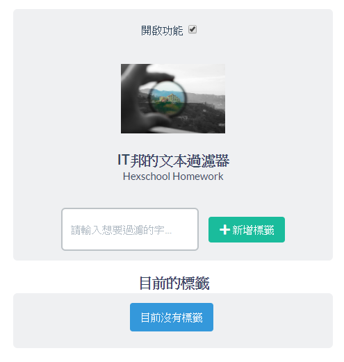

# IT 邦專用 Filter

## 介紹:

* 在 IT 邦頁面(//ithelp.ithome.com.tw)自動篩選您不想要的文章。
* 可以新增與刪除多個關鍵字
* 六角學院的作業

## 安裝方式:

* 點擊右方 Clone or Download 按鈕，接著點選下方 Download ZIP 進行下載並解壓縮
* 開啟 Chrome，點選右方方 自訂及管理 Google Chrome -> 自訂工具 -> 擴充功能
* 於擴充功能頁面點選左上方 載入未封裝擴充功能，選擇下載的資料夾
* 瀏覽器右方方會出現一個 Filter 的放大鏡，在您進入 [IT邦的頁面](https://ithelp.ithome.com.tw)時才可以使用

## 使用方式:

* 在輸入欄中寫希望過濾的關鍵字，然後點選 "新增標籤" 按鈕，即可新增過濾標籤
* 新增標籤的當下會立刻對當前頁面進行過濾
* 新增的標籤會顯示在下方，點選相對應的標籤就可以將標籤刪除
* 刪除標籤後，要再次載入頁面才會回復被過濾的資料。原先被過濾的資料是不會自己回的的 :/
* 上方開啟功能勾勾，會決定過濾功能是否啟動。同樣要等新頁面載入才會看到效果喔。

### 操作介面

祝您使用愉快 :+1: